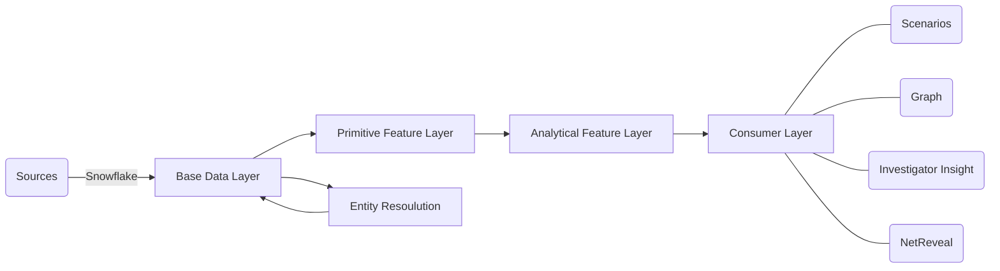

# --------

# AML Data Foundation

The AML Data Foundation serves as the primary data source for all Anti-Crime related activities within DNB. It forms the backbone for Transaction Monitoring, Investigator Insight, Customer Scoring, The Graph, and Netreveal. It's designed to offer DNB's optimal data for AML purposes, but is not meant to support operational tasks outside the Anti-Crime spectrum.

## Structure Overview

The AML Data Foundation comprises roughly four distinct layers, plus an additional specialized area:

- **Staging**: Where ingest the data. A pure technical layer that will not be exposed to the consumers or outside of IT.
- **Base Data Layer**: Transforms and structures data akin to a traditional data warehouse.
- **Primitive Feature Layer**: Houses features that are semantically pure, each tied to a base table on a one-to-one basis.
- **Analytical Feature Layer**: Aggregates and integrates primitive features with base data.
- **Consumer Layer**: Customizes data formatting and consolidation for consumers. This includes APIs, views, and direct data consumption.
- **Entity Resolution Microservice**: A system to identify entities. Designed to utilize any method and can be further developed independently from the rest of the Data Foundation.

## Features and Feature Groups

Within the second and third layers, the concept of "Features" is pivotal. A feature can be interpreted in various ways. We describe it as "a piece of derived information associated with a data object". While this definition may seem broad, it's intentional. The term's comprehensive nature is challenging to capture succinctly across systems. However, in practice, a feature represents a specific attribute or statement about another entity or event.

Some features examples of features might include:

* If a party in a transaction is outside of norway.
* If a customer is a crypto curreny exchange.
* If an account has been used for USD transactions.

It is here important to understand that the features (almost) always says something about another data element. It says something about a Customer, a transaction, an account, ect.

### Definition of Features

Features can be characterized in myriad ways. Our methodology draws inspiration from the *International Classification of Crime for Statistical Purposes* (ICCS). Every feature and feature group is clarified using three distinct text fields:

* **Description**: This provides an overarching description of the feature or feature group and holds precedence over the subsequent fields.
* **Includes**: Specifies what elements are encompassed within the feature or feature group.
* **Excludes**: Clearly demarcates what elements aren't considered part of the feature or feature group.

This delineation compels a meticulous examination of inclusions and exclusions, aspects that can be inadvertently overlooked. When integrated, these descriptions cement the schematic definition of the feature. Adhering to the open-close principle for features, while these definitions remain static, they can be fine-tuned, provided the foundational meaning remains consistent.

### Feature groups

Feature groups cluster features with thematic similarities. While each group might span various features and data domains, their core essence remains consistent.

Consider the "cross-border" concept. The notion of whether a Transfere of Value is cross-border isn't straightforward. Multiple interpretations, each with its advantages and purposes, exist. For instance, within the cross-border feature group, you might find:

> **is_crossing_a_pysical_border**
> Indicates if the funds have genuinely crossed a border, focusing solely on the funds and not the parties or their locations.

> **any_party_in_a_different_country_from_any_other**
> Reveals if any involved parties are situated in a country distinct from others. This differs from the prior definition where an account holder might be in a different country than the actual account.

These examples underscore slight differences in definition. Yet, in practical applications, these distinctions matter.

Our approach ensures flexibility for consumers. We don't mandate a singular definition; instead, we emphasize consistency. If you employ a specific "cross-border" interpretation in your application and later opt for a change, you shouldn't alter the existing feature. Instead, create a new one or leverage an existing feature with a different meaning.

> **The open-close priciple for features**
> Features are closed for modification but open for addition. You can never change the scematic meaning of a feature, you will have to add a new one. You can improve the feature as much as possible as long as the feature scematic meaning stays the same. This includes new data sources.

### Time-Based Features

Features often have a temporal dimension. For instance, one might want to track the number of cross-border transactions a customer made in the past month.

Addressing this requirement can be challenging because different consumers might have specific time frames in mind. Further complexity arises when some consumers operate on a principle of "data as then" coupled with "code as now". This necessitates retaining a record of how the time frame was historically defined.

Consequently, the general guideline is that features with an inherent time window should, by default, aggregate data daily. Exceptions, supported by robust use-cases, can be made for quarterly, monthly, yearly, or hourly aggregation.

Examples of such features include:

* Number of transactions
* Number of cross-border transactions
* Number of logins

This approach eliminates vague aggregations like "over the past X days or months". Instead, consumers must delineate the exact date range in their code.

> **The Calendar Directive for Features**
> Features quantified over a time frame should adhere to calendar-based aggregation. This implies calculations over specified calendar units such as a day, month, year, or hour, rather than a relative period from the obervers's perspective.

## Structural Components

### Base Data Layer

The Base Data Layer consolidates incoming data, modeling it akin to a traditional data warehouse. It categorizes data into four primary types:

- **Things**: Pertains to stable objects. These entities don't change frequently, but their associated features might. Examples include Customers, Accounts, Addresses, etc.
- **Events**: Focuses on transient objects. These are events that occur and then vanish. For instance, Transactions, Logins, Emails, Chats, Sales, etc.
- **Reference**: Provides supplemental data that helps interpret the primary data. This might encompass Country Information, Transaction Codes, DNB-specific codes, Statistical Classifications, etc.
- **Ad Hoc**: Incorporates temporary data that isn't part of the long-term structure. Examples are Corona fraud lookup, Panama Papers, etc.

#### Data domains

Within the Base Data Layer, data is partitioned into distinct domains. These domains represent specific data types and invariably align with one of the four categories delineated above.

A primary objective for establishing these domains is to retain their technical independence for as long as possible. That means that the customer domain and the account domain does not intermix before the later parts of the base data layer. This is to have clear data lineages and make data quality evaluations simpler.

Presently, the data domains encompass:

* **Transfere of value (TOV)**: This captures any value exchange, primarily monetary transactions.

**NOTE:** The repertoire of data domains expands continually.

### The Primitive Feature Layer

The second layer of the data foundation is the Primitive Feature Layer. Each primitive feature is defined by its unambiguous schematic meaning and its direct one-to-one association with a base table. Designed for simplicity, each primitive feature should encapsulate only one precise meaning.

Ensuring clarity in defining primitive features is paramount. Ambiguity can lead to complications, as illustrated by the "cross-border" example. A feature that is too broad or imprecise fails to qualify as primitive. This is particularly evident when attempting to blend multiple meanings into a single feature, such as "Cross Border" and "International".

> **Mixed Meanings**
> During the creation of primitive features, it's essential to remain vigilant about combining varied meanings. A primitive feature should resonate with one distinct meaning. For instance, it should be either "Cross Border" or "Crypto" – not both.

#### Zero-Dependent Primitive Features

While a primitive feature can be derived from other primitive features, our preference leans towards independence. Features that solely depend on the base data layer are termed *zero-dependent primitive features*. The aspiration is for all primitive features to fall into this category, streamlining the dependency graph and facilitating more straightforward maintenance and updates.

### Analytical Feature Layer

The third tier within the AML Data Foundation is the Analytical Feature Layer. While it shares many parallels with the Primitive Feature Layer, it's more flexible in its rules and requirements. Although these features are tailored for specific purposes, they remain versatile for multiple consumers. Typically, they maintain a one-to-one relationship with a base table, barring certain exceptions.

Such features can integrate various primitive features and any data from the base layer. However, they mustn't rely on other analytical features. This approach aims to boost decoupling, enhancing the system's maintainability and efficiency.

> **Zero Dependency Rule for Analytical Features**:
> Analytical features can harness primitive features and data from the base data layer. Dependency on other analytical features is not permitted.

### Consumer Layer

Situated at the pinnacle of the AML Data Foundation is the Consumer Layer. It is dedicated to molding data according to specific consumer needs. For instance, this is where the transfer of value and other tables adapt to the IFS format for NetReveal. Each consumer possesses a designated area for their data extracts and APIs. Any alterations to the data model to align with a source should transpire exclusively within this layer. Adding data to the lower layers is permissible, but only within the confines of the AML Data Foundation model.

> **Non-Influence Rule for Consumers**:
> Consumers should not influence the data model in any foundational or feature layers of the AML Data Foundation. Specialized modeling and formatting must be confined to the Consumer Layer.

### Entity Resolution

Positioned outside the traditional layers of the AML Data Foundation lies the Entity Resolution system. Its chief function is entity identification and property aggregation. Its independent setup is intentional, anticipating extensive specialized development and tooling requirements. There's potential for leveraging off-the-shelf products.

While batch processing is a primary use, the system may also be made available via an API or similar platforms. Due to its intricate nature, this segment of the system may warrant its dedicated team.

---

**NOTE:** TO BE FILLED OUT

## Rules and Best Practices

The AML Data Foundation has a set of usage and design rules that will be strictly enforced. They are not there to make the life of the developer harder, they are there to protect the overarching design.

It also has a set of best practices that are guiding on how we perfer that things are done, but can be adapted if the conditions require it.

### Rules

All time aggregations are calander driven -

### Best practices
